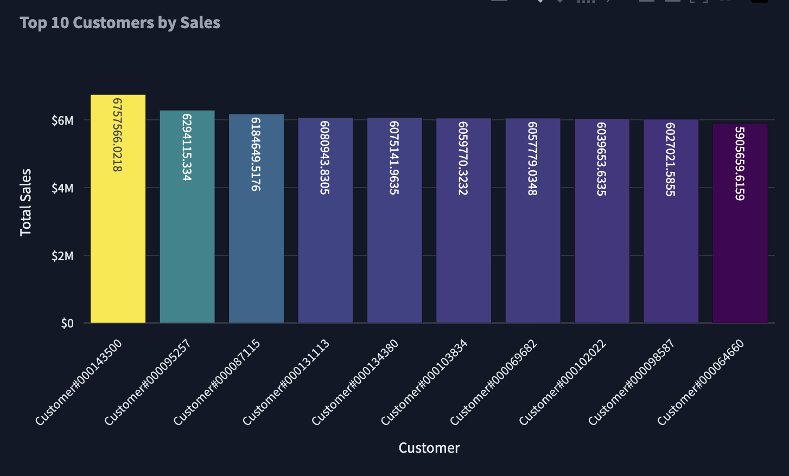
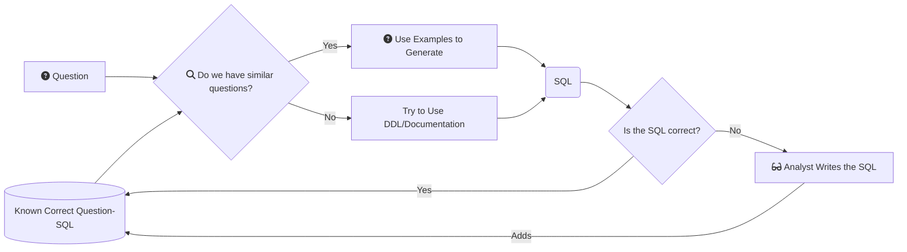

| GitHub | PyPI | Colab | Documentation |
| ------ | ---- | ----- | ------------- |
| [](https://github.com/vanna-ai/vanna-py) | [](https://pypi.org/project/vanna/) | [](https://colab.research.google.com/github/vanna-ai/vanna-py/blob/main/notebooks/vn-starter.ipynb) | [](https://docs.vanna.ai) |

# Vanna.AI

Vanna is a Python-based AI SQL co-pilot. Our initial users are data-savvy data analysts, data scientists, engineers, and similar people that use Vanna to automate writing complex SQL.

Vanna can:
- [Convert natural language to SQL](#natural-language-to-sql)
- [Run SQL](#run-sql)
- [Generate Plotly code](#generate-plotly-code)
- [Run Plotly code](#run-plotly-code)
- [Get better over time](#improve-your-training-data)
- Be used in a Jupyter Notebooks, Colab, or other Python environments
- Be used with Snowflake, BigQuery, and other databases
- Be used with Python UIs, such as [Streamlit](https://github.com/vanna-ai/vanna-streamlit), Dash, and others
- Be used to make Slack bots

## Natural Language to SQL
```python
sql = vn.generate_sql(question='Who are the top 10 customers?')
```

### Output:
```sql
SELECT customer_name,
       total_sales
FROM   (SELECT c.c_name as customer_name,
               sum(l.l_extendedprice * (1 - l.l_discount)) as total_sales,
               row_number() OVER (ORDER BY sum(l.l_extendedprice * (1 - l.l_discount)) desc) as rank
        FROM   snowflake_sample_data.tpch_sf1.lineitem l join snowflake_sample_data.tpch_sf1.orders o
                ON l.l_orderkey = o.o_orderkey join snowflake_sample_data.tpch_sf1.customer c
                ON o.o_custkey = c.c_custkey
        GROUP BY customer_name)
WHERE  rank <= 10;
```

## Run SQL
This function is provided as a convenience. You can choose to run your SQL however you normally do and use the rest of the downstream functions.
```python
df = vn.get_results(cs, database, sql)
```

### Output:
| customer_name | total_sales |
| ------------- | ----------- |
| Customer#000000001 |  68127.72 |
| Customer#000000002 |  65898.69 |
...

## Generate Plotly Code
```python
plotly_code = vn.generate_plotly_code(question=my_question, sql=sql, df=df)
```

### Output:
```python
fig = go.Figure(go.Bar(
    x=df['CUSTOMER_NAME'],
    y=df['TOTAL_SALES'],
    marker={'color': df['TOTAL_SALES'], 'colorscale': 'Viridis'},
    text=df['TOTAL_SALES'],
    textposition='auto',
))

fig.update_layout(
    title="Top 10 Customers by Sales",
    xaxis_title="Customer",
    yaxis_title="Total Sales",
    xaxis_tickangle=-45,
    yaxis_tickprefix="$",
)
```

## Run Plotly Code
```python
fig = vn.get_plotly_figure(plotly_code=plotly_code, df=df)
fig.show()
```

### Output:


## Improve Your Training Data
```python
vn.store_sql(
    question=my_question,
    sql=sql,
)
```

## How Vanna Works


# Getting Started

## Install Vanna from PyPI and import it:
```python
%pip install vanna
import vanna as vn
```

## Enter your email to set an API Key
This will send a one-time code to your email address. Copy and paste the code into the prompt.
```python
my_email = '' # Enter your email here
vn.login(email=my_email)
```

## Add Training Data
```python
vn.train(
    question="Which products have the highest sales?",
    sql="...",
)
```

## Generate SQL
```python
sql = vn.generate_sql(question="Who are the top 10 customers?")
```

# Documentation
[Full Documentation](https://docs.vanna.ai)