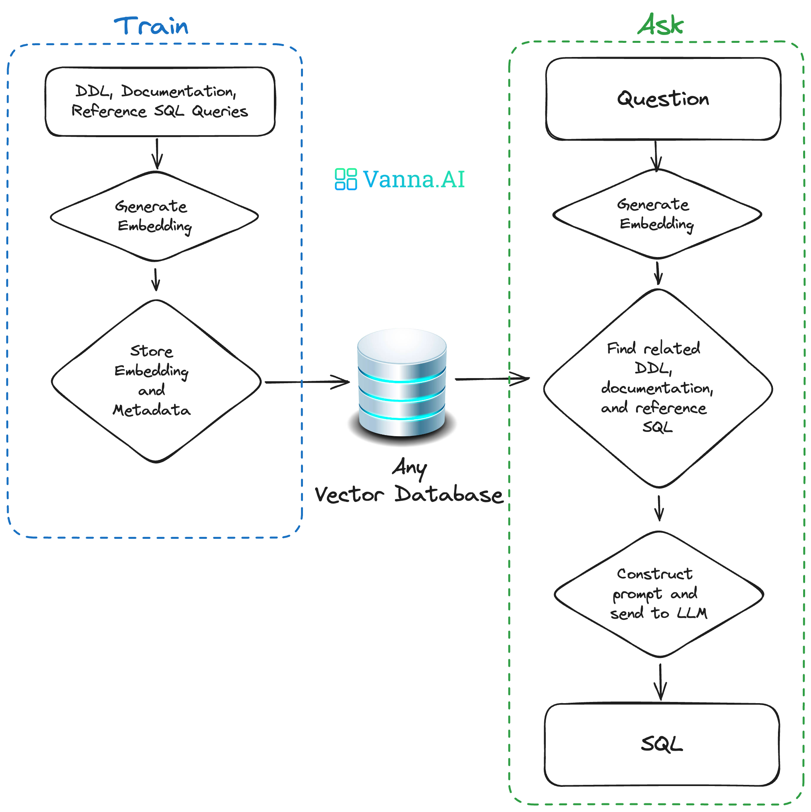
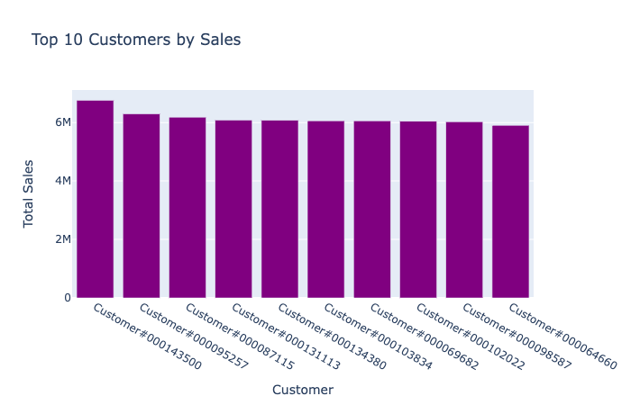

| GitHub | PyPI | Documentation |
| ------ | ---- | ------------- |
| [](https://github.com/vanna-ai/vanna) | [](https://pypi.org/project/vanna/) | [](https://vanna.ai/docs/) |

# Vanna
Vanna is an MIT-licensed open-source Python RAG (Retrieval-Augmented Generation) framework for SQL generation and related functionality.

https://github.com/vanna-ai/vanna/assets/7146154/1901f47a-515d-4982-af50-f12761a3b2ce


## How Vanna works


Vanna works in two easy steps - train a RAG "model" on your data, and then ask questions which will return SQL queries that can be set up to automatically run on your database.

1. **Train a RAG "model" on your data**.
2. **Ask questions**.



If you don't know what RAG is, don't worry -- you don't need to know how this works under the hood to use it. You just need to know that you "train" a model, which stores some metadata and then use it to "ask" questions.

See the [base class](https://github.com/vanna-ai/vanna/blob/main/src/vanna/base/base.py) for more details on how this works under the hood.

## User Interfaces
These are some of the user interfaces that we've built using Vanna. You can use these as-is or as a starting point for your own custom interface.

- [Jupyter Notebook](https://vanna.ai/docs/postgres-openai-vanna-vannadb/)
- [vanna-ai/vanna-streamlit](https://github.com/vanna-ai/vanna-streamlit)
- [vanna-ai/vanna-flask](https://github.com/vanna-ai/vanna-flask)
- [vanna-ai/vanna-slack](https://github.com/vanna-ai/vanna-slack)


## Getting started
See the [documentation](https://vanna.ai/docs/) for specifics on your desired database, LLM, etc.

If you want to get a feel for how it works after training, you can try this [Colab notebook](https://vanna.ai/docs/app/).


### Install
```bash
pip install vanna
```

There are a number of optional packages that can be installed so see the [documentation](https://vanna.ai/docs/) for more details.

### Import
See the [documentation](https://vanna.ai/docs/) if you're customizing the LLM or vector database.

```python
# The import statement will vary depending on your LLM and vector database. This is an example for OpenAI + ChromaDB

from vanna.openai.openai_chat import OpenAI_Chat
from vanna.chromadb.chromadb_vector import ChromaDB_VectorStore

class MyVanna(ChromaDB_VectorStore, OpenAI_Chat):
    def __init__(self, config=None):
        ChromaDB_VectorStore.__init__(self, config=config)
        OpenAI_Chat.__init__(self, config=config)

vn = MyVanna(config={'api_key': 'sk-...', 'model': 'gpt-4-...'})

# See the documentation for other options

```


## Training
You may or may not need to run these `vn.train` commands depending on your use case. See the [documentation](https://vanna.ai/docs/) for more details.

These statements are shown to give you a feel for how it works.

### Train with DDL Statements
DDL statements contain information about the table names, columns, data types, and relationships in your database.

```python
vn.train(ddl="""
    CREATE TABLE IF NOT EXISTS my-table (
        id INT PRIMARY KEY,
        name VARCHAR(100),
        age INT
    )
""")
```

### Train with Documentation
Sometimes you may want to add documentation about your business terminology or definitions.

```python
vn.train(documentation="Our business defines XYZ as ...")
```

### Train with SQL
You can also add SQL queries to your training data. This is useful if you have some queries already laying around. You can just copy and paste those from your editor to begin generating new SQL.

```python
vn.train(sql="SELECT name, age FROM my-table WHERE name = 'John Doe'")
```


## Asking questions
```python
vn.ask("What are the top 10 customers by sales?")
```

You'll get SQL
```sql
SELECT c.c_name as customer_name,
        sum(l.l_extendedprice * (1 - l.l_discount)) as total_sales
FROM   snowflake_sample_data.tpch_sf1.lineitem l join snowflake_sample_data.tpch_sf1.orders o
        ON l.l_orderkey = o.o_orderkey join snowflake_sample_data.tpch_sf1.customer c
        ON o.o_custkey = c.c_custkey
GROUP BY customer_name
ORDER BY total_sales desc limit 10;
```

If you've connected to a database, you'll get the table:
<div>
<table border="1" class="dataframe">
  <thead>
    <tr style="text-align: right;">
      <th></th>
      <th>CUSTOMER_NAME</th>
      <th>TOTAL_SALES</th>
    </tr>
  </thead>
  <tbody>
    <tr>
      <th>0</th>
      <td>Customer#000143500</td>
      <td>6757566.0218</td>
    </tr>
    <tr>
      <th>1</th>
      <td>Customer#000095257</td>
      <td>6294115.3340</td>
    </tr>
    <tr>
      <th>2</th>
      <td>Customer#000087115</td>
      <td>6184649.5176</td>
    </tr>
    <tr>
      <th>3</th>
      <td>Customer#000131113</td>
      <td>6080943.8305</td>
    </tr>
    <tr>
      <th>4</th>
      <td>Customer#000134380</td>
      <td>6075141.9635</td>
    </tr>
    <tr>
      <th>5</th>
      <td>Customer#000103834</td>
      <td>6059770.3232</td>
    </tr>
    <tr>
      <th>6</th>
      <td>Customer#000069682</td>
      <td>6057779.0348</td>
    </tr>
    <tr>
      <th>7</th>
      <td>Customer#000102022</td>
      <td>6039653.6335</td>
    </tr>
    <tr>
      <th>8</th>
      <td>Customer#000098587</td>
      <td>6027021.5855</td>
    </tr>
    <tr>
      <th>9</th>
      <td>Customer#000064660</td>
      <td>5905659.6159</td>
    </tr>
  </tbody>
</table>
</div>

You'll also get an automated Plotly chart:


## RAG vs. Fine-Tuning
RAG
- Portable across LLMs
- Easy to remove training data if any of it becomes obsolete
- Much cheaper to run than fine-tuning
- More future-proof -- if a better LLM comes out, you can just swap it out

Fine-Tuning
- Good if you need to minimize tokens in the prompt
- Slow to get started
- Expensive to train and run (generally)

## Why Vanna?

1. **High accuracy on complex datasets.**
    - Vanna’s capabilities are tied to the training data you give it
    - More training data means better accuracy for large and complex datasets
2. **Secure and private.**
    - Your database contents are never sent to the LLM or the vector database
    - SQL execution happens in your local environment
3. **Self learning.**
    - If using via Jupyter, you can choose to "auto-train" it on the queries that were successfully executed
    - If using via other interfaces, you can have the interface prompt the user to provide feedback on the results
    - Correct question to SQL pairs are stored for future reference and make the future results more accurate
4. **Supports any SQL database.**
    - The package allows you to connect to any SQL database that you can otherwise connect to with Python
5. **Choose your front end.**
    - Most people start in a Jupyter Notebook.
    - Expose to your end users via Slackbot, web app, Streamlit app, or a custom front end.

## Extending Vanna
Vanna is designed to connect to any database, LLM, and vector database. There's a [VannaBase](https://github.com/vanna-ai/vanna/blob/main/src/vanna/base/base.py) abstract base class that defines some basic functionality. The package provides implementations for use with OpenAI and ChromaDB. You can easily extend Vanna to use your own LLM or vector database. See the [documentation](https://vanna.ai/docs/) for more details.

## Vanna in 100 Seconds

https://github.com/vanna-ai/vanna/assets/7146154/eb90ee1e-aa05-4740-891a-4fc10e611cab

## More resources
 - [Full Documentation](https://vanna.ai/docs/)
 - [Website](https://vanna.ai)
 - [Discord group for support](https://discord.gg/qUZYKHremx)
