# Vanna 2.0: Turn Questions into Data Insights

**Natural language → SQL → Answers.** Now with enterprise security and user-aware permissions.

[](https://python.org)
[](LICENSE)
[](https://github.com/psf/black)

https://github.com/user-attachments/assets/476cd421-d0b0-46af-8b29-0f40c73d6d83


---

## What's New in 2.0

🔐 **User-Aware at Every Layer** — Queries automatically filtered per user permissions

🎨 **Modern Web Interface** — Beautiful pre-built `<vanna-chat>` component

⚡ **Streaming Responses** — Real-time tables, charts, and progress updates

🔒 **Enterprise Security** — Row-level security, audit logs, rate limiting

🔄 **Production-Ready** — FastAPI integration, observability, lifecycle hooks

> **Upgrading from 0.x?** See the [Migration Guide](MIGRATION_GUIDE.md) | [What changed?](#migration-notes)

---

## Get Started

### Try it with Sample Data

[Quickstart](https://vanna.ai/docs/quick-start)

### Configure

[Configure](https://vanna.ai/docs/configure)

### Web Component

```html
<!-- Drop into any existing webpage -->
<script src="https://img.vanna.ai/vanna-components.js"></script>
<vanna-chat
  sse-endpoint="https://your-api.com/chat"
  theme="dark">
</vanna-chat>
```

Uses your existing cookies/JWTs. Works with React, Vue, or plain HTML.

---

## What You Get

Ask a question in natural language and get back:

**1. Streaming Progress Updates**

**2. SQL Code Block (By default only shown to "admin" users)**

**3. Interactive Data Table**

**4. Charts** (Plotly visualizations)

**5. Natural Language Summary**

All streamed in real-time to your web component.

---

## Why Vanna 2.0?

### ✅ Get Started Instantly
* Production chat interface
* Custom agent with your database
* Embed in any webpage

### ✅ Enterprise-Ready Security
**User-aware at every layer** — Identity flows through system prompts, tool execution, and SQL filtering
**Row-level security** — Queries automatically filtered per user permissions
**Audit logs** — Every query tracked per user for compliance
**Rate limiting** — Per-user quotas via lifecycle hooks

### ✅ Beautiful Web UI Included
**Pre-built `<vanna-chat>` component** — No need to build your own chat interface
**Streaming tables & charts** — Rich components, not just text
**Responsive & customizable** — Works on mobile, desktop, light/dark themes
**Framework-agnostic** — React, Vue, plain HTML

### ✅ Works With Your Stack
**Any LLM:** OpenAI, Anthropic, Ollama, Azure, Google Gemini, AWS Bedrock, Mistral, Others
**Any Database:** PostgreSQL, MySQL, Snowflake, BigQuery, Redshift, SQLite, Oracle, SQL Server, DuckDB, ClickHouse, Others
**Your Auth System:** Bring your own — cookies, JWTs, OAuth tokens
**Your Framework:** FastAPI, Flask

### ✅ Extensible But Opinionated
**Custom tools** — Extend the `Tool` base class
**Lifecycle hooks** — Quota checking, logging, content filtering
**LLM middlewares** — Caching, prompt engineering
**Observability** — Built-in tracing and metrics

---

## Architecture


---

## How It Works

```mermaid
sequenceDiagram
    participant U as 👤 User
    participant W as 🌐 <vanna-chat>
    participant S as 🐍 Your Server
    participant A as 🤖 Agent
    participant T as 🧰 Tools

    U->>W: "Show Q4 sales"
    W->>S: POST /api/vanna/v2/chat_sse (with auth)
    S->>A: User(id=alice, groups=[read_sales])
    A->>T: Execute SQL tool (user-aware)
    T->>T: Apply row-level security
    T->>A: Filtered results
    A->>W: Stream: Table → Chart → Summary
    W->>U: Display beautiful UI
```



**Key Concepts:**

1. **User Resolver** — You define how to extract user identity from requests (cookies, JWTs, etc.)
2. **User-Aware Tools** — Tools automatically check permissions based on user's group memberships
3. **Streaming Components** — Backend streams structured UI components (tables, charts) to frontend
4. **Built-in Web UI** — Pre-built `<vanna-chat>` component renders everything beautifully

---

## Production Setup with Your Auth

Here's a complete example integrating Vanna with your existing FastAPI app and authentication:

```python
from fastapi import FastAPI
from vanna import Agent
from vanna.servers.fastapi.routes import register_chat_routes
from vanna.servers.base import ChatHandler
from vanna.core.user import UserResolver, User, RequestContext
from vanna.integrations.anthropic import AnthropicLlmService
from vanna.tools import RunSqlTool
from vanna.integrations.sqlite import SqliteRunner
from vanna.core.registry import ToolRegistry

# Your existing FastAPI app
app = FastAPI()

# 1. Define your user resolver (using YOUR auth system)
class MyUserResolver(UserResolver):
    async def resolve_user(self, request_context: RequestContext) -> User:
        # Extract from cookies, JWTs, or session
        token = request_context.get_header('Authorization')
        user_data = self.decode_jwt(token)  # Your existing logic

        return User(
            id=user_data['id'],
            email=user_data['email'],
            group_memberships=user_data['groups']  # Used for permissions
        )

# 2. Set up agent with tools
llm = AnthropicLlmService(model="claude-sonnet-4-5")
tools = ToolRegistry()
tools.register(RunSqlTool(sql_runner=SqliteRunner("./data.db")))

agent = Agent(
    llm_service=llm,
    tool_registry=tools,
    user_resolver=MyUserResolver()
)

# 3. Add Vanna routes to your app
chat_handler = ChatHandler(agent)
register_chat_routes(app, chat_handler)

# Now you have:
# - POST /api/vanna/v2/chat_sse (streaming endpoint)
# - GET / (optional web UI)
```

**Then in your frontend:**
```html
<vanna-chat sse-endpoint="/api/vanna/v2/chat_sse"></vanna-chat>
```

See [Full Documentation](https://vanna.ai/docs) for custom tools, lifecycle hooks, and advanced configuration

---

## Custom Tools

Extend Vanna with custom tools for your specific use case:

```python
from vanna.core.tool import Tool, ToolContext, ToolResult
from pydantic import BaseModel, Field
from typing import Type

class EmailArgs(BaseModel):
    recipient: str = Field(description="Email recipient")
    subject: str = Field(description="Email subject")

class EmailTool(Tool[EmailArgs]):
    @property
    def name(self) -> str:
        return "send_email"

    @property
    def access_groups(self) -> list[str]:
        return ["send_email"]  # Permission check

    def get_args_schema(self) -> Type[EmailArgs]:
        return EmailArgs

    async def execute(self, context: ToolContext, args: EmailArgs) -> ToolResult:
        user = context.user  # Automatically injected

        # Your business logic
        await self.email_service.send(
            from_email=user.email,
            to=args.recipient,
            subject=args.subject
        )

        return ToolResult(success=True, result_for_llm=f"Email sent to {args.recipient}")

# Register your tool
tools.register(EmailTool())
```

---

## Advanced Features

Vanna 2.0 includes powerful enterprise features for production use:

**Lifecycle Hooks** — Add quota checking, custom logging, content filtering at key points in the request lifecycle

**LLM Middlewares** — Implement caching, prompt engineering, or cost tracking around LLM calls

**Conversation Storage** — Persist and retrieve conversation history per user

**Observability** — Built-in tracing and metrics integration

**Context Enrichers** — Add RAG, memory, or documentation to enhance agent responses

**Agent Configuration** — Control streaming, temperature, max iterations, and more

---

## Use Cases

**Vanna is ideal for:**
- 📊 Data analytics applications with natural language interfaces
- 🔐 Multi-tenant SaaS needing user-aware permissions
- 🎨 Teams wanting a pre-built web component + backend
- 🏢 Enterprise environments with security/audit requirements
- 📈 Applications needing rich streaming responses (tables, charts, SQL)
- 🔄 Integrating with existing authentication systems

---

## Community & Support

- 📖 **[Full Documentation](https://vanna.ai/docs)** — Complete guides and API reference
- 💡 **[GitHub Discussions](https://github.com/vanna-ai/vanna/discussions)** — Feature requests and Q&A
- 🐛 **[GitHub Issues](https://github.com/vanna-ai/vanna/issues)** — Bug reports
- 📧 **Enterprise Support** — support@vanna.ai

---

## Migration Notes

**Upgrading from Vanna 0.x?**

Vanna 2.0 is a complete rewrite focused on user-aware agents and production deployments. Key changes:

- **New API**: Agent-based instead of `VannaBase` class methods
- **User-aware**: Every component now knows the user identity
- **Streaming**: Rich UI components instead of text/dataframes
- **Web-first**: Built-in `<vanna-chat>` component and server

**Migration path:**

1. **Quick wrap** — Use `LegacyVannaAdapter` to wrap your existing Vanna 0.x instance and get the new web UI immediately
2. **Gradual migration** — Incrementally move to the new Agent API and tools

See the complete [Migration Guide](MIGRATION_GUIDE.md) for step-by-step instructions.

---

## License

MIT License — See [LICENSE](LICENSE) for details.

---

**Built with ❤️ by the Vanna team** | [Website](https://vanna.ai) | [Docs](https://vanna.ai/docs) | [Discussions](https://github.com/vanna-ai/vanna/discussions)
