# Vanna 2.0+: Web-First, User-Aware Agent Framework

> [!WARNING]
> This version of Vanna is actively under development and may contain breaking changes until it is officially released to PyPI.
>
> To install while in development, use:
> ```bash
> pip install --force-reinstall --no-cache-dir 'vanna[flask,anthropic] @ git+https://github.com/vanna-ai/vanna.git@v2'
> ```

> [!IMPORTANT]
> If you're upgrading from an older version of Vanna, use the [Migration Guide](MIGRATION_GUIDE.md).

> **Turn natural language into data insights — with enterprise-grade security baked in**

Vanna is purpose-built for **data analytics** with **user awareness** as a first-class concern. Drop in our web component, connect your existing auth, and start querying data securely.

[](https://python.org)
[](LICENSE)
[](https://github.com/psf/black)

---

## Why Vanna?

```mermaid
graph LR
    A[👤 User asks:<br/>'Show me Q4 sales'] --> B[🔐 Identity flows through<br/>every layer]
    B --> C[🧰 Tools execute securely<br/>with permissions]
    C --> D[📊 Rich UI streams back<br/>tables, charts, code]

    style B fill:#FFD93D,stroke:#333,stroke-width:3px
```



### What Makes Vanna Different

**Built for Production Data Analytics**
- **Pre-built web component + backend** — No need to build your own chat UI
- **User-aware at every layer** — Identity and permissions flow through the entire system
- **Rich streaming responses** — Tables, charts, SQL code blocks, not just text
- **Works with your existing auth** — Cookies, JWTs, session tokens
- **Enterprise security built-in** — Row-level security, audit logs, rate limiting

---

## Quick Start

### Installation

```bash
pip install vanna[anthropic]  # or [openai]
```

### Basic Example

```python
from vanna import Agent, AgentConfig
from vanna.servers.fastapi import VannaFastAPIServer
from vanna.core.registry import ToolRegistry
from vanna.core.user import UserResolver, User, RequestContext
from vanna.integrations.anthropic import AnthropicLlmService
from vanna.tools import RunSqlTool
from vanna.integrations.sqlite import SqliteRunner

# 1. Define how to resolve users from requests
class SimpleUserResolver(UserResolver):
    async def resolve_user(self, request_context: RequestContext) -> User:
        # In production, validate cookies/JWTs here
        user_id = request_context.get_cookie('user_id') or 'demo_user'
        return User(id=user_id, group_memberships=['read_sales'])

# 2. Set up LLM and tools
llm = AnthropicLlmService(model="claude-sonnet-4-5")
tools = ToolRegistry()
tools.register(RunSqlTool(sql_runner=SqliteRunner(database_path="./data.db")))

# 3. Create agent
agent = Agent(
    llm_service=llm,
    tool_registry=tools,
    user_resolver=SimpleUserResolver()
)

# 4. Create and run server
server = VannaFastAPIServer(agent)
app = server.create_app()

# Run with: uvicorn main:app --host 0.0.0.0 --port 8000 --reload
# Visit http://localhost:8000 to see the web UI
```

---


---

## What Makes Vanna Unique

### 1. User-Aware by Design

Every layer of the system knows **who the user is** and **what they can access**.

```mermaid
sequenceDiagram
    participant U as 👤 User
    participant W as 🌐 Web Component
    participant S as 🐍 Flask/FastAPI
    participant R as 🪪 User Resolver
    participant A as 🤖 Agent
    participant T as 🧰 Tools

    U->>W: "Show Q4 sales"
    W->>S: POST /api/vanna/v2/chat_sse
    S->>R: Extract user identity
    R->>A: User(id=alice, group_memberships=[read_sales])
    A->>A: Generate personalized system prompt
    A->>T: Execute SQL tool (user-aware)
    T->>T: Apply row-level security
    T->>A: Return filtered results
    A->>W: Stream: Table → Chart → Summary
    W->>U: Display results
```



**Not just authentication — authorization at every step:**

- System prompt customized per user
- Tools check permissions before execution
- SQL queries filtered by row-level security
- Audit logs per user
- Rate limiting per user

### 2. Drop-in Web Component

```html
<!-- Works with any existing app -->
<vanna-chat
  api-endpoint="/api/vanna/v2/chat_sse"
  initial-message="What can I help you with?"
  theme="dark">
</vanna-chat>
```

**Features:**
- Uses your existing cookies/JWTs (no new login system)
- Renders streaming tables, charts, SQL code blocks
- Responsive and customizable
- Framework-agnostic (works with React, Vue, plain HTML)

### 3. Purpose-Built for Data Analytics

**Out-of-the-box tools:**
- SQL generation and execution (with user permissions)
- Data visualization with Plotly
- File system operations (for coding agents)
- Python code execution (sandboxed)

```python
from vanna.tools import RunSqlTool, VisualizeDataTool
from vanna.integrations.sqlite import SqliteRunner
from vanna.integrations.local import LocalFileSystem

file_system = LocalFileSystem("./data")

tools.register(RunSqlTool(
    sql_runner=SqliteRunner(database_path="./data.db"),
    file_system=file_system
))
tools.register(VisualizeDataTool(file_system=file_system))
```

### 4. Enterprise-Ready

| Feature | Description |
|---------|-------------|
| **Row-Level Security** | SQL tools respect database permissions |
| **Audit Logs** | Every query and tool call logged per user |
| **Rate Limiting** | Per-user token/request limits via lifecycle hooks |
| **Observability** | Built-in tracing and debugging hooks |
| **Conversation Management** | Persistent conversation storage |
| **Content Filtering** | Extensible filtering system |

---

## Architecture


### Core Concepts

**1. User Resolver** — You define this!

```python
from vanna.core.user import UserResolver, User, RequestContext

class MyUserResolver(UserResolver):
    async def resolve_user(self, request_context: RequestContext) -> User:
        # Extract from your existing auth system
        token = request_context.get_header('Authorization')
        user_data = self.decode_jwt(token)  # Your logic

        return User(
            id=user_data['id'],
            email=user_data['email'],
            group_memberships=user_data['groups'],  # Key!
            metadata={'role': user_data['role']}
        )
```

**2. User-Aware Tools** — Check permissions automatically

```python
from vanna.core.tool import Tool, ToolContext, ToolResult
from pydantic import BaseModel, Field
from typing import Type

class QueryArgs(BaseModel):
    query: str = Field(description="SQL query to execute")

class CustomSQLTool(Tool[QueryArgs]):
    @property
    def name(self) -> str:
        return "query_database"

    @property
    def description(self) -> str:
        return "Execute a SQL query against the database"

    @property
    def access_groups(self) -> list[str]:
        return ["read_sales"]  # Only users in this group can use this tool

    def get_args_schema(self) -> Type[QueryArgs]:
        return QueryArgs

    async def execute(self, context: ToolContext, args: QueryArgs) -> ToolResult:
        user = context.user  # Automatically injected

        # Apply row-level security
        filtered_query = self.add_user_filters(args.query, user)
        results = await self.db.execute(filtered_query)

        return ToolResult(
            success=True,
            result_for_llm=str(results)
        )
```

**3. Streaming UI Components**

```python
async for component in agent.send_message(request_context=ctx, message="Show sales"):
    # Rich component: structured data (tables, charts, status cards)
    print(type(component.rich_component).__name__)

    # Simple component: plain text fallback
    print(component.simple_component.text)
```

Output:
```
StatusBarUpdateComponent    # "Processing..."
TaskTrackerUpdateComponent  # "Load conversation context"
RichTextComponent          # "Let me query the sales data..."
StatusCardComponent        # "Executing run_sql"
DataFrameComponent         # Tabular results
RichTextComponent          # "Here are your top customers..."
```

---

## Add to Existing FastAPI App

If you already have a FastAPI application, you can add Vanna as additional routes:

```python
from fastapi import FastAPI
from vanna import Agent, AgentConfig
from vanna.servers.base import ChatHandler
from vanna.servers.fastapi.routes import register_chat_routes
from vanna.core.registry import ToolRegistry
from vanna.core.user import UserResolver, User, RequestContext
from vanna.integrations.anthropic import AnthropicLlmService
from vanna.tools import RunSqlTool
from vanna.integrations.sqlite import SqliteRunner

# Your existing FastAPI app
app = FastAPI()

# Your existing routes
@app.get('/api/users')
async def get_users():
    return {'users': [...]}

@app.get('/api/products')
async def get_products():
    return {'products': [...]}

# Add Vanna agent
class CookieUserResolver(UserResolver):
    async def resolve_user(self, request_context: RequestContext) -> User:
        user_id = request_context.get_cookie('user_id') or 'anonymous'
        role = request_context.get_cookie('role') or 'guest'

        groups = []
        if role == 'admin':
            groups = ['read_sales', 'read_confidential', 'admin']
        elif role == 'analyst':
            groups = ['read_sales']

        return User(id=user_id, group_memberships=groups)

# Set up agent
llm = AnthropicLlmService(model="claude-sonnet-4-5")
tools = ToolRegistry()
tools.register(RunSqlTool(sql_runner=SqliteRunner(database_path="./data.db")))

agent = Agent(
    llm_service=llm,
    tool_registry=tools,
    user_resolver=CookieUserResolver()
)

# Add Vanna routes to your existing app
chat_handler = ChatHandler(agent)
register_chat_routes(app, chat_handler)

# Run with: uvicorn main:app --host 0.0.0.0 --port 8000 --reload
```

This adds these endpoints to your existing FastAPI app:
- `GET /` - Vanna web component UI (you may want to change this)
- `POST /api/vanna/v2/chat_sse` - Server-Sent Events streaming
- `POST /api/vanna/v2/chat_poll` - Polling endpoint
- `GET /health` - Health check

To customize the routes or serve the UI at a different path, see the [server configuration docs](https://docs.vanna.ai).

---

## Custom Tools

Create custom tools by extending the `Tool` base class:

```python
from vanna.core.tool import Tool, ToolContext, ToolResult
from vanna.components import UiComponent, NotificationComponent, SimpleTextComponent, ComponentType
from pydantic import BaseModel, Field
from typing import Type

class EmailArgs(BaseModel):
    recipient: str = Field(description="Email recipient")
    subject: str = Field(description="Email subject")
    body: str = Field(description="Email body")

class EmailTool(Tool[EmailArgs]):
    @property
    def name(self) -> str:
        return "send_email"

    @property
    def description(self) -> str:
        return "Send an email to a user"

    @property
    def access_groups(self) -> list[str]:
        return ["send_email"]  # Only users in this group can use this tool

    def get_args_schema(self) -> Type[EmailArgs]:
        return EmailArgs

    async def execute(self, context: ToolContext, args: EmailArgs) -> ToolResult:
        user = context.user

        # Check domain restrictions
        if not args.recipient.endswith('@company.com'):
            error_msg = "Can only send to company email addresses"
            return ToolResult(
                success=False,
                result_for_llm=error_msg,
                error=error_msg,
                ui_component=UiComponent(
                    rich_component=NotificationComponent(
                        type=ComponentType.NOTIFICATION,
                        level="error",
                        message=error_msg
                    ),
                    simple_component=SimpleTextComponent(text=error_msg)
                )
            )

        # Send email (your logic)
        await self.email_service.send(
            from_email=user.email,
            to=args.recipient,
            subject=args.subject,
            body=args.body
        )

        success_msg = f"Email sent to {args.recipient}"
        return ToolResult(
            success=True,
            result_for_llm=success_msg,
            ui_component=UiComponent(
                rich_component=NotificationComponent(
                    type=ComponentType.NOTIFICATION,
                    level="success",
                    message=success_msg
                ),
                simple_component=SimpleTextComponent(text=success_msg)
            )
        )

# Register tool
tools.register(EmailTool())
```

---

## Configuration

### Agent Configuration

```python
from vanna import AgentConfig

config = AgentConfig(
    max_tool_iterations=10,           # Max tool calls per message
    stream_responses=True,             # Enable streaming
    temperature=0.7,                   # LLM temperature
    include_thinking_indicators=True,  # Show "Thinking..." states
    auto_save_conversations=True,      # Auto-persist conversations
    max_tokens=None                    # Maximum response tokens
)

agent = Agent(
    llm_service=llm,
    tool_registry=tools,
    user_resolver=user_resolver,
    config=config
)
```

### Environment Variables

```bash
# Anthropic
export ANTHROPIC_API_KEY="sk-ant-..."
export ANTHROPIC_MODEL="claude-sonnet-4-5"

# OpenAI
export OPENAI_API_KEY="sk-..."
export OPENAI_MODEL="gpt-5"

# Database
export DATABASE_URL="postgresql://localhost/mydb"
```

---

## Advanced Features

### 1. Conversation Storage

```python
from vanna.integrations.local import MemoryConversationStore

# Use in-memory storage (default)
store = MemoryConversationStore()

agent = Agent(
    llm_service=llm,
    tool_registry=tools,
    user_resolver=user_resolver,
    conversation_store=store
)

# List user's conversations
alice = User(id="alice")
conversations = await store.list_conversations(user=alice)

# Get conversation history
conversation = await store.get_conversation(
    conversation_id="conv_123",
    user=alice
)
```

### 2. Lifecycle Hooks

```python
from vanna.core.lifecycle import LifecycleHook

class QuotaCheckHook(LifecycleHook):
    async def before_message(self, user: User, message: str) -> str:
        # Check if user has quota remaining
        if not await self.check_quota(user.id):
            raise Exception("Quota exceeded")
        return message

    async def after_tool(self, result: ToolResult) -> ToolResult:
        # Log tool execution
        await self.log_tool_execution(result)
        return result

agent = Agent(
    llm_service=llm,
    tool_registry=tools,
    user_resolver=user_resolver,
    lifecycle_hooks=[QuotaCheckHook()]
)
```

### 3. LLM Middlewares

```python
from vanna.core.middleware import LlmMiddleware
from vanna.core.llm import LlmRequest, LlmResponse

class CachingMiddleware(LlmMiddleware):
    async def before_llm_request(self, request: LlmRequest) -> LlmRequest:
        # Check cache before sending to LLM
        cached = await self.cache.get(request)
        if cached:
            return cached
        return request

    async def after_llm_response(
        self,
        request: LlmRequest,
        response: LlmResponse
    ) -> LlmResponse:
        # Cache the response
        await self.cache.set(request, response)
        return response

agent = Agent(
    llm_service=llm,
    tool_registry=tools,
    user_resolver=user_resolver,
    llm_middlewares=[CachingMiddleware()]
)
```

### 4. Observability

```python
from vanna.core.observability import ObservabilityProvider

class LoggingProvider(ObservabilityProvider):
    async def create_span(self, name: str, attributes: dict):
        print(f"Starting: {name}")
        return Span(name, attributes)

    async def record_metric(self, name: str, value: float, unit: str, tags: dict):
        print(f"Metric: {name} = {value}{unit}")

agent = Agent(
    llm_service=llm,
    tool_registry=tools,
    user_resolver=user_resolver,
    observability_provider=LoggingProvider()
)
```

### 5. Context Enrichers

```python
from vanna.core.enricher import ContextEnricher
from vanna.core.tool import ToolContext

class UserMetadataEnricher(ContextEnricher):
    async def enrich_context(self, context: ToolContext) -> ToolContext:
        # Add additional user metadata from database
        user_metadata = await self.db.get_user_metadata(context.user.id)
        context.user.metadata.update(user_metadata)
        return context

agent = Agent(
    llm_service=llm,
    tool_registry=tools,
    user_resolver=user_resolver,
    context_enrichers=[UserMetadataEnricher()]
)
```

---

## When to Use Vanna

**Vanna is ideal for:**
- Building data analytics applications with natural language interfaces
- Applications requiring user-aware permissions throughout
- Teams that want a pre-built web component + backend integration
- Enterprise environments with strict security requirements
- Use cases needing rich streaming responses (tables, charts, SQL)
- Integrating with existing authentication systems

---

## Documentation

- **Migration Guide**: [Migrating from Vanna 1.x to 2.0+](MIGRATION_GUIDE.md)
- **GitHub Discussions**: [GitHub Discussions](https://github.com/vanna-ai/vanna/discussions)
- **Email**: support@vanna.ai
