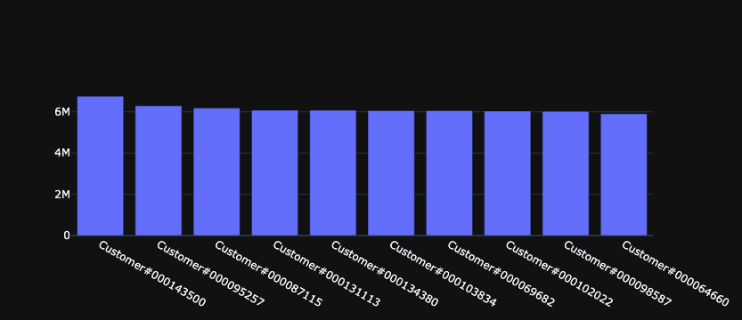
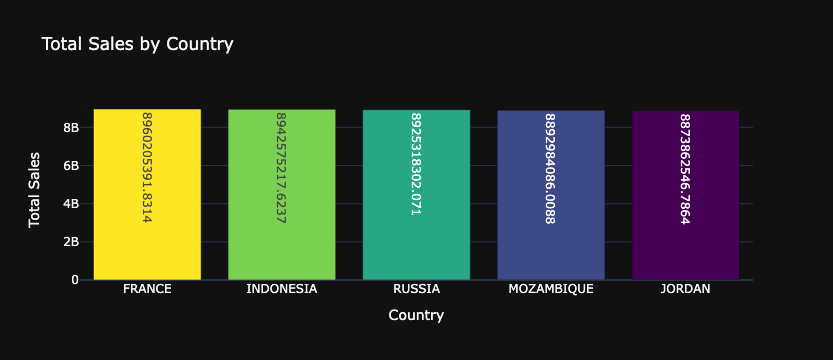
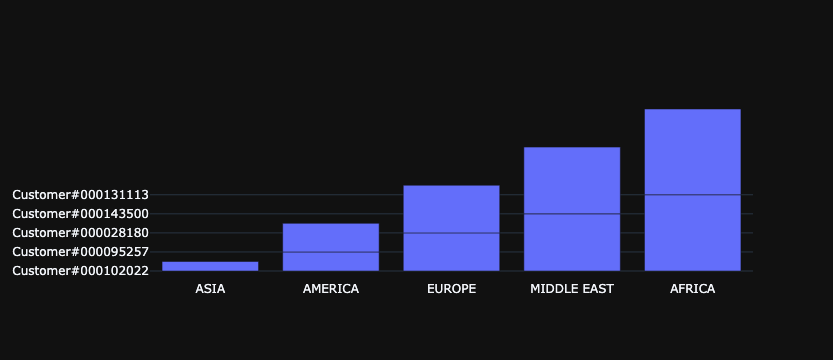

This notebook will help you unleash the full potential of AI-powered data analysis at your organization. We'll go through how to "bulk train" Vanna and generate SQL, tables, charts, and explanations, all with minimal code and effort. For more about Vanna, see our [intro blog post](https://medium.com/vanna-ai/intro-to-vanna-a-python-based-ai-sql-co-pilot-218c25b19c6a).

[](https://colab.research.google.com/github/vanna-ai/vanna-py/blob/main/notebooks/vn-full.ipynb)

[](https://github.com/vanna-ai/vanna-py/blob/main/notebooks/vn-full.ipynb)

# Install Vanna
First we install Vanna from [PyPI](https://pypi.org/project/vanna/) and import it.
Here, we'll also install the Snowflake connector. If you're using a different database, you'll need to install the appropriate connector.


```python
%pip install vanna
%pip install snowflake-connector-python
```


```python
import vanna as vn
import snowflake.connector
import pandas as pd
```

# Login
Creating a login and getting an API key is as easy as entering your email (after you run this cell) and entering the code we send to you. Check your Spam folder if you don't see the code.


```python
api_key = vn.get_api_key('my-email@example.com')
vn.set_api_key(api_key)
```

# Set your Model
You need to choose a globally unique model name. Try using your company name or another unique string. All data from models are isolated - there's no leakage.


```python
vn.set_model('my-model') # Enter your dataset name here. This is a globally unique identifier for your dataset.
```

# Set Database Connection
These details are only referenced within your notebook. These database credentials are never sent to Vanna's severs.


```python
vn.connect_to_snowflake(account='my-account', username='my-username', password='my-password', database='my-database')
```

# Get Results
This gets the SQL, gets the dataframe, and prints them both. Note that we use your connection string to execute the SQL on your warehouse from your local instance. Your connection nor your data gets sent to Vanna's servers. For more info on how Vanna works, [see this post](https://medium.com/vanna-ai/how-vanna-works-how-to-train-it-data-security-8d8f2008042).


```python
vn.ask("What are the top 10 customers by sales?")
```

    SELECT c.c_name as customer_name,
           sum(l.l_extendedprice * (1 - l.l_discount)) as total_sales
    FROM   snowflake_sample_data.tpch_sf1.lineitem l join snowflake_sample_data.tpch_sf1.orders o
            ON l.l_orderkey = o.o_orderkey join snowflake_sample_data.tpch_sf1.customer c
            ON o.o_custkey = c.c_custkey
    GROUP BY customer_name
    ORDER BY total_sales desc limit 10;




    AI-generated follow-up questions:
    What are the countries of the top 10 customers by sales?
    How many orders did each of the top 10 customers place?
    What is the average sales amount per customer in the top 10?
    Can you provide a breakdown of the sales by country for the top 10 customers?
    Who are the top 10 customers in terms of returned parts gross value?
    What are the total sales for each customer in the top 3?
    Can you provide a breakdown of the sales by region for the top customers?
    How many customers are there in each country?
    What is the total revenue for the top 5 countries?
    Can you provide a breakdown of the sales by customer for the top 5 countries?


```python
vn.ask("Which 5 countries have the highest sales?")
```

    SELECT n.n_name as country_name,
           sum(l.l_extendedprice * (1 - l.l_discount)) as total_sales
    FROM   snowflake_sample_data.tpch_sf1.nation n join snowflake_sample_data.tpch_sf1.customer c
            ON n.n_nationkey = c.c_nationkey join snowflake_sample_data.tpch_sf1.orders o
            ON c.c_custkey = o.o_custkey join snowflake_sample_data.tpch_sf1.lineitem l
            ON o.o_orderkey = l.l_orderkey
    GROUP BY country_name
    ORDER BY total_sales desc limit 5;


<div>
<style scoped>
    .dataframe tbody tr th:only-of-type {
        vertical-align: middle;
    }

    .dataframe tbody tr th {
        vertical-align: top;
    }

    .dataframe thead th {
        text-align: right;
    }
</style>
<table border="1" class="dataframe">
  <thead>
    <tr style="text-align: right;">
      <th></th>
      <th>COUNTRY_NAME</th>
      <th>TOTAL_SALES</th>
    </tr>
  </thead>
  <tbody>
    <tr>
      <th>0</th>
      <td>FRANCE</td>
      <td>8960205391.8314</td>
    </tr>
    <tr>
      <th>1</th>
      <td>INDONESIA</td>
      <td>8942575217.6237</td>
    </tr>
    <tr>
      <th>2</th>
      <td>RUSSIA</td>
      <td>8925318302.0710</td>
    </tr>
    <tr>
      <th>3</th>
      <td>MOZAMBIQUE</td>
      <td>8892984086.0088</td>
    </tr>
    <tr>
      <th>4</th>
      <td>JORDAN</td>
      <td>8873862546.7864</td>
    </tr>
  </tbody>
</table>
</div>





    AI-generated follow-up questions:
    What are the total sales for each country?
    Which country has the highest number of customers?
    What are the total sales for each customer?
    What are the top 3 customers with the highest sales?
    What is the total revenue for each customer and country?
    What are the total sales for each customer in Europe?
    What are the top 10 countries with the highest total order amount?
    Which country has the highest number of failed orders?
    What are the top 3 customers with the highest sales?


```python
vn.ask("Who are the top 2 biggest customers in each region?")
```

    with ranked_customers as (SELECT c.c_name as customer_name,
                                     r.r_name as region_name,
                                     row_number() OVER (PARTITION BY r.r_name
                                                        ORDER BY sum(l.l_quantity * l.l_extendedprice) desc) as rank
                              FROM   snowflake_sample_data.tpch_sf1.customer c join snowflake_sample_data.tpch_sf1.orders o
                                      ON c.c_custkey = o.o_custkey join snowflake_sample_data.tpch_sf1.lineitem l
                                      ON o.o_orderkey = l.l_orderkey join snowflake_sample_data.tpch_sf1.nation n
                                      ON c.c_nationkey = n.n_nationkey join snowflake_sample_data.tpch_sf1.region r
                                      ON n.n_regionkey = r.r_regionkey
                              GROUP BY customer_name, region_name)
    SELECT region_name,
           customer_name
    FROM   ranked_customers
    WHERE  rank <= 2;


<div>
<style scoped>
    .dataframe tbody tr th:only-of-type {
        vertical-align: middle;
    }

    .dataframe tbody tr th {
        vertical-align: top;
    }

    .dataframe thead th {
        text-align: right;
    }
</style>
<table border="1" class="dataframe">
  <thead>
    <tr style="text-align: right;">
      <th></th>
      <th>REGION_NAME</th>
      <th>CUSTOMER_NAME</th>
    </tr>
  </thead>
  <tbody>
    <tr>
      <th>0</th>
      <td>ASIA</td>
      <td>Customer#000102022</td>
    </tr>
    <tr>
      <th>1</th>
      <td>ASIA</td>
      <td>Customer#000148750</td>
    </tr>
    <tr>
      <th>2</th>
      <td>AMERICA</td>
      <td>Customer#000095257</td>
    </tr>
    <tr>
      <th>3</th>
      <td>AMERICA</td>
      <td>Customer#000091630</td>
    </tr>
    <tr>
      <th>4</th>
      <td>EUROPE</td>
      <td>Customer#000028180</td>
    </tr>
    <tr>
      <th>5</th>
      <td>EUROPE</td>
      <td>Customer#000053809</td>
    </tr>
    <tr>
      <th>6</th>
      <td>MIDDLE EAST</td>
      <td>Customer#000143500</td>
    </tr>
    <tr>
      <th>7</th>
      <td>MIDDLE EAST</td>
      <td>Customer#000103834</td>
    </tr>
    <tr>
      <th>8</th>
      <td>AFRICA</td>
      <td>Customer#000131113</td>
    </tr>
    <tr>
      <th>9</th>
      <td>AFRICA</td>
      <td>Customer#000134380</td>
    </tr>
  </tbody>
</table>
</div>





    AI-generated follow-up questions:
    - What are the total sales for each customer in Europe?
    - What are the total sales for each customer in the United States?
    - How many customers are there in each country?
    - What is the total revenue for each customer in each country?
    - Which customers have the highest total sales?
    - Which customers have the highest number of orders?
    - Which customers have the highest returned parts gross value in Africa?
    - What are the total sales for the top 3 customers?
    - What are the total sales for the top 10 customers?
    - What is the total sales for each customer?


# Run as a Web App
If you would like to use this functionality in a web app, you can deploy the Vanna Streamlit app and use your own secrets. See [this repo](https://github.com/vanna-ai/vanna-streamlit).
