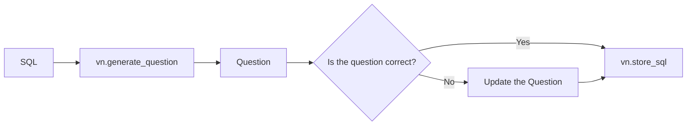
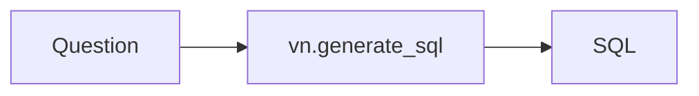

## What do I need to do to use **Vanna.AI**?
Vanna.AI uses a combination of documentation and historical question and SQL pairs to generate SQL from natural language.

### Step 1: Train **Vanna.AI**
- Give **Vanna.AI** sample SQL
- **Vanna.AI** will try to guess the question
- Verify the question is correct

### Step 2: Ask **Vanna.AI** a Question

