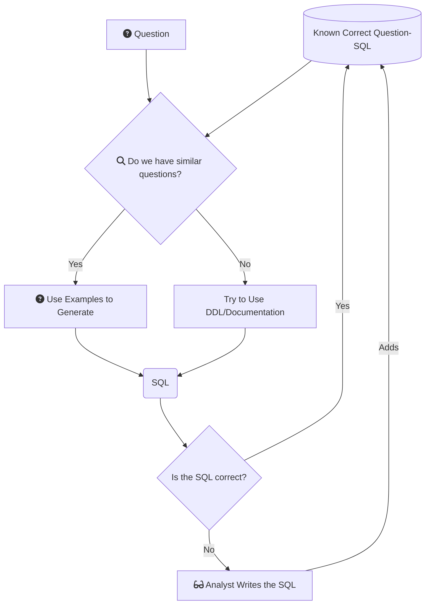

# What's the Workflow?

```mermaid
flowchart TD
    DB[(Known Correct Question-SQL)]
    Try[Try to Use DDL/Documentation]
    SQL(SQL)
    Check{Is the SQL correct?}
    Generate[fa:fa-circle-question Use Examples to Generate]
    DB --> Find
    Question[fa:fa-circle-question Question] --> Find{fa:fa-magnifying-glass Do we have similar questions?}
    Find -- Yes --> Generate
    Find -- No --> Try
    Generate --> SQL
    Try --> SQL
    SQL --> Check
    Check -- Yes --> DB
    Check -- No --> Analyst[fa:fa-glasses Analyst Writes the SQL]
    Analyst -- Adds --> DB
```