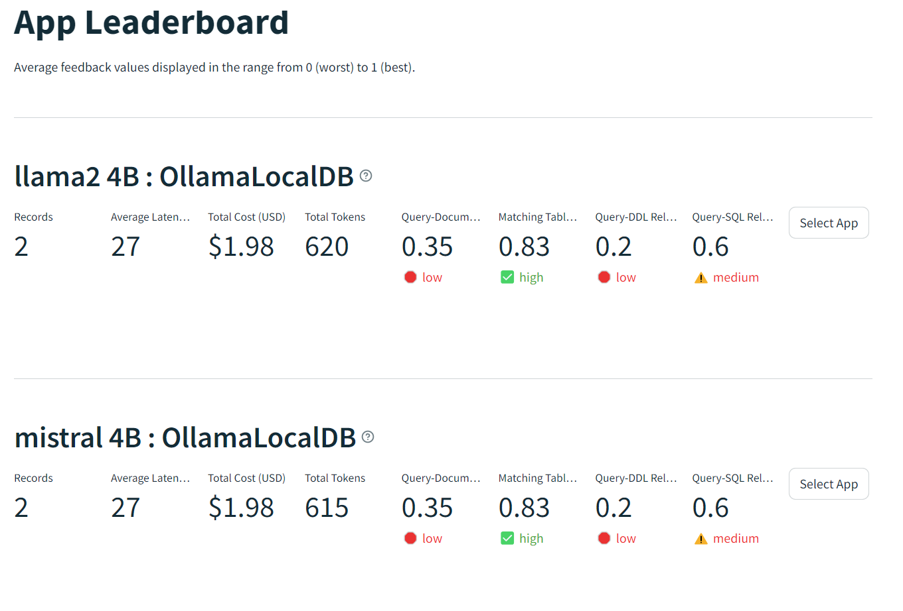
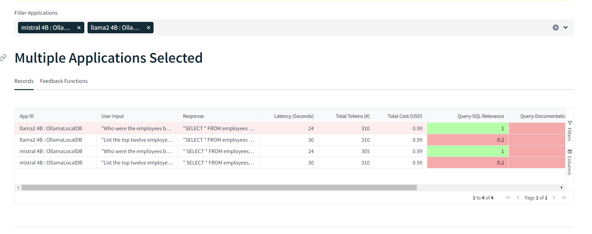
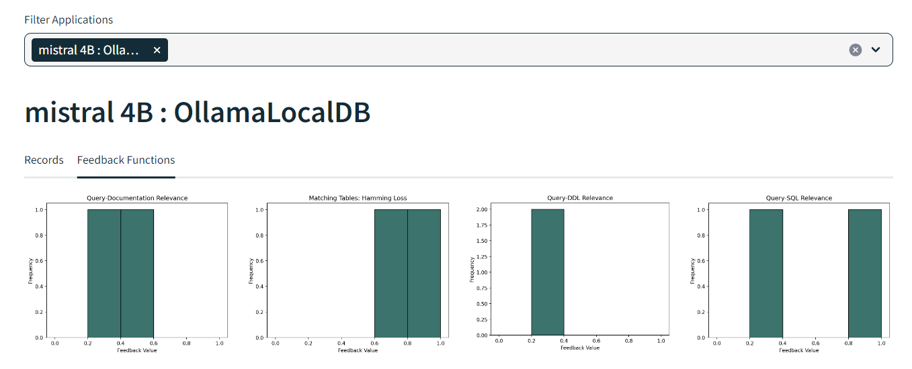
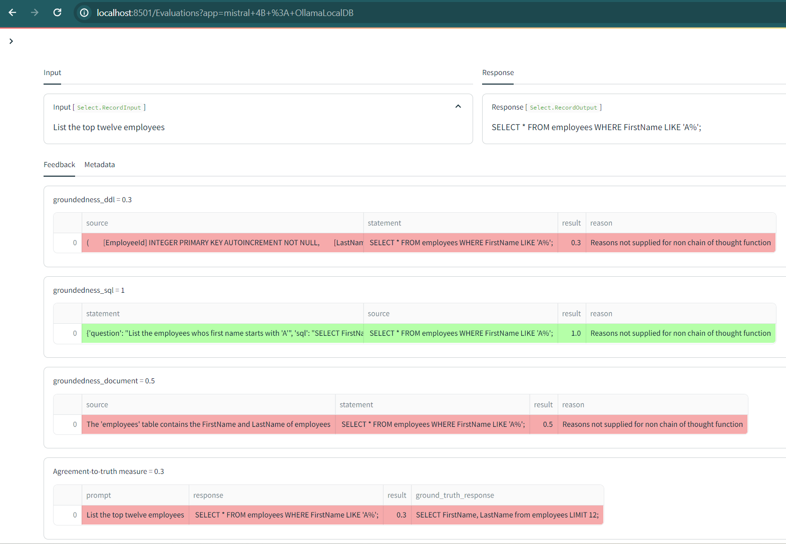

## Evaluation of Vanna using TruLens Eval

1. [Install Trulens package](https://www.trulens.org/trulens_eval/install/).
2. In `evaluation/app_evaluation.py`, Configure the metrics to use, the test data (example user questions).
3. Run the script, and open dashboard at http://localhost:8501 to view results as they're processed.

### Compare multiple versions of the Vanna app

### See performance per-run of `vanna.generate_sql()`

### Overview of test results across multiple metrics

### Examining the inputs & outputs of context relevance metrics

- **Agreement to truth**: the response SQL is compared to the ground truth SQL.
- **Groundedness**: How much overlap there is in meaning, between a context item and the response SQL
    - **sql**: The final SQL, and a question-sql pair retrieved from the vector store. An average of all example SQL-question pair scores (this is using just n=1)
    - **ddl**: The final SQL, and a DDL pair retrieved from the vector store.
    - **document**: The final SQL, and a document retrieved from the vector store.

